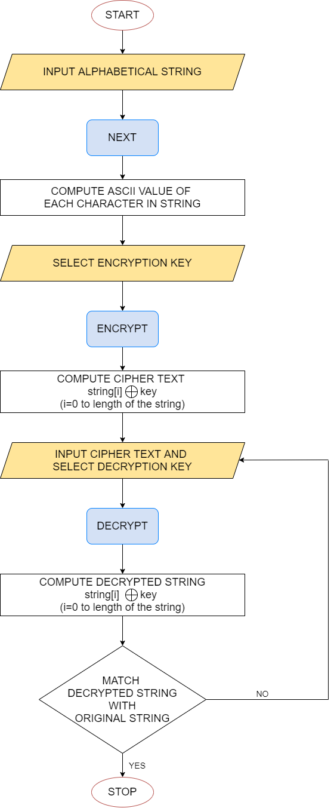

## Storyboard (Round 2)

Experiment 1: Write a C program that xor each character in a string with 0-9 and displays the result.

### 1. Story Outline:

In cryptography, the simple XOR cipher is a type of additive cipher. The concept of implementation is to first define XOR – encryption key and then to perform XOR operation of the characters in the String with this key which we want to encrypt. In order to get the original String, we need to decrypt each characters. To decrypt the encrypted characters we have to perform XOR operation again with the defined key.

### 2. Story:

Describe the Story intorduction here (guide : The next step is to write a story. Story should be a brief logical description in simple English. It should talk about the overall execution of the experiment in a simplified manner. (should not include any equations/ drawings). The story should include the following points) )

#### 2.1 Set the Visual Stage Description:
Describe here : (guide When a user lands up into a simulator, the visual stage is the first thing that user comes across. The visual stage should include all the elements to be seen by a user on an imaginary canvas.  (This should NOT include any drawings. ) )

#### 2.2 Set User Objectives & Goals:
1. The prime objective of this experiment is to demonstrate the process of Encryption and Decryption using XOR Cipher. 
2. The simulator visually shows every step so that user may better understand the logic behind the process. 
3. To display the different scenarios on chosing different Encryption-Decryption Key. 
4. To answer the assesment based on the observations. 

#### 2.3 Set the Pathway Activities:

1. User has to provide an alphabetical string which user wants to encrypt. 
2. Click on Next and choose an encryption key from the list. 
3. Click on Encrypt and the Cipher text will be generated. 
4. User has to provide the generated Cipher text and choose a decryption key from the list. 
5. Click on Decrypt and the decrypted text will be generated and matched with the original text provided by the user at start. 

##### 2.4 Set Challenges and Questions/Complexity/Variations in Questions:

Describe the challenges Here : (guide : Set Challenges and Questions/Complexity/variations in questions according to User’s level, so as to invoke the learners’ interest.  (while traversing, what challenges he will face? how he has to solve and overcome ? descriptive).)

##### 2.5 Allow pitfalls:

1. The simulator is designed for encrypting only alphabetical string, therefore student must be attentive while providing plain text. 
2. Student must be attentive while decrypting the cipher text, as a small change in either cipher text or decryption key will cause an incorrect decrypted text. 

##### 2.6 Conclusion:

1. Assessment/evaluation of the pre-test and post-test should be given immediately to the user. The moment the student clicks on the answer of his choice, the CORRECT ANSWER should be displayed below the question. This would enable the student to understand whether he is right or wrong. 
2. This would prompt the users as to how many answers were correctly answered. 
3. The given plain text is to be encrypted using XOR Cipher and then answered accordingly. 
4. The given Cipher text is to be decrypted using XOR Cipher and then answered accordingly. 

##### 2.7 Equations/formulas:
Cipher Text = Plain Text &oplus; Key 
Plain Text = Cipher Text &oplus; Key 

### 3. Flowchart 4
 
link to flow chart Here : Store in the  /flowchart folder within Round2 folder in your repo
 
(guide :The lab proposer should extract logic from the story, prepare a flowchart from the story narration and write the algorithm to execute the black box.  use Google Drawings https://docs.google.com/drawings/ (send the link to your flowchart and also attach .png by exporting it )

### 4. Mindmap:

 Link to mindmap here : Store the mindmap in both .mm & .png extension in the  /mindmap folder and include link of only .pdf verison here
  
 (guide : An elaborate mind map (connecting all the points in the experiment flow ) should be prepared and submitted by the lab proposer. The mind map should be a clear and detailed document that takes into account all minute intri5acies involved in the development of virtual lab. The mindmap should be self-content and any developer across the globe should be able to code it with all those details. using only FreeMind http://freemind.sourceforge.net/wiki/index.php/Main_Page (send the .png file and also the original .mm extension project file. )

### 5. Storyboard :
Storyboard: <a href="Storyboard/carwiper.gif"> [here]</a>
Link to storybaord (.gif file ) here :
(guide: This document should include sketching and description scene wise (duration, action, description). Software to be used for storyboarding : https://wonderunit.com/storyboarder/ (Its a FOSS tool) . tutorial on how to use it https://www.youtube.com/watch?v=LAeCEpG0KX4
