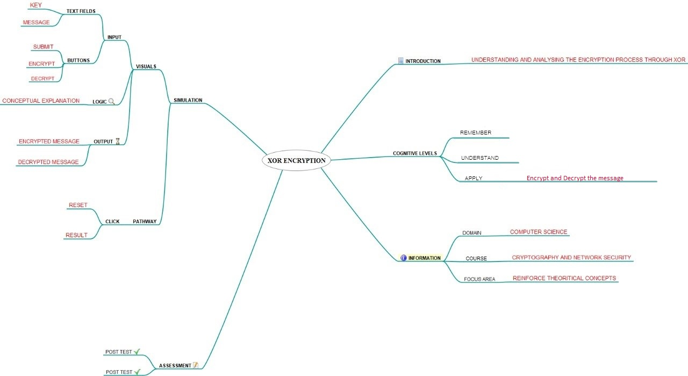

## Storyboard (Round 2)

Experiment 1: Write a C program that xor each character in a string with character key 0-9 and displays the result.

### 1. Story Outline:

In cryptography, the simple XOR cipher is a type of additive cipher. The concept of implementation is to first define XOR – encryption key and then to perform XOR operation of the characters in the String with this key which we want to encrypt. In order to get the original String, we need to decrypt each characters. To decrypt the encrypted characters we have to perform XOR operation again with the defined key.

### 2. Story:

XOR cipher employs the XOR logical operation in order to encrypt data. The most common component in order to generate complex ciphers XOR operator is extremely used. XOR operation uses the same key for both encryption and decryption. First, either a random key is generated or choosen. Then, XOR operation is performed using the key so that an encrypted data is created.
In order to decrypt, the same key should be used and XOR operation should be run again. That is why it is known as a symmetric encryption. 
The advantage of XOR operator is that it is simple to implement, and that the XOR operation is computationally inexpensive. That is why XOR is used inside most encryption algorithms or used with various other encryption methods. A simple repeating XOR (means the same key is used for xor operation on the whole data) cipher is therefore sometimes used for hiding information in cases where no particular security is required. To make reverse engineering in case of computer malware more difficult XOR cipher is often used .In XOR cipher operation when random key size is as long as the message itself, it is impossible to crack it. In other words, it can be said it offers a very high level of security.

#### 2.1 Set the Visual Stage Description:

We divided our whole simulator into 3 parts. The left most part comprises all the inputs like plain-text and key while encrypting and cipher-text and key while decrypting. This part lets the user interact with the simulator.  
The right most part contains C program code which runs according to the different states of simulator. This part lets the user understand the implementation of XOR-Cipher in C Programming Language. The middle part is subdivided into two parts. 
The Top part deals with logical process of xor-encryption and xor-decryption. This part lets the user know how the encryption and decryption is actually being performed. The bottom part contains all the output generated while encryption and decryption.
 

#### 2.2 Set User Objectives & Goals:
1. The prime objective of this experiment is to demonstrate the process of Encryption and Decryption using XOR Cipher. 
2. The simulator visually shows every step so that user may better understand the logic behind the process. 
3. To display the different scenarios on chosing different Encryption-Decryption Key. 
4. To answer the assesment based on the observations. 

#### 2.3 Set the Pathway Activities:

1. User has to provide an alphabetical string which user wants to encrypt. 
2. Click on Next and choose an encryption key from the list. 
3. Click on Encrypt and the Cipher text will be generated. 
4. User has to provide the generated Cipher text and choose a decryption key from the list. 
5. Click on Decrypt and the decrypted text will be generated and matched with the original text provided by the user at start. 

##### 2.4 Set Challenges and Questions/Complexity/Variations in Questions:

Q. What will be the output if we xor any character with integer number 0? 
<b>A. the character itself</b> 
B. 0 
C. 1 
D. None of the above 

Q. Decryption process and Encryption process in XOR-Cipher is different. 
A. True 
<b>B. False</b> 

Q. XOR returns 1 if: 
A. Both Numbers are same 
<b>B. Both Numbers are different</b> 
C. Both Numbers are 0 
D. Both Numbers are 1 

Q. In C progamming language XOR is represented by: 
A. ! 
<b>B. ^</b> 
C. || 
D. && 
E. None of the above 

Q. Mark the most suitable option. In this experiment XOR-Cipher is performed on: 
A. Characters 
B. Integers 
<b>C. ASCII values of character</b> 
D. None of the above 

##### 2.5 Allow pitfalls:

1. The simulator is designed for encrypting only alphabetical string, therefore student must be attentive while providing plain text. 
2. Student must be attentive while decrypting the cipher text, as a small change in either cipher text or decryption key will cause an incorrect decrypted text. 

##### 2.6 Conclusion:

1. Assessment/evaluation of the pre-test and post-test should be given immediately to the user. The moment the student clicks on the answer of his choice, the CORRECT ANSWER should be displayed below the question. This would enable the student to understand whether he is right or wrong. 
2. This would prompt the users as to how many answers were correctly answered. 
3. The given plain text is to be encrypted using XOR Cipher and then answered accordingly. 
4. The given Cipher text is to be decrypted using XOR Cipher and then answered accordingly. 

##### 2.7 Equations/formulas:
Cipher Text = Plain Text &oplus; Key 
Plain Text = Cipher Text &oplus; Key 

### 3. Flowchart 4
 

### 4. Mindmap:

### 5. Storyboard :

